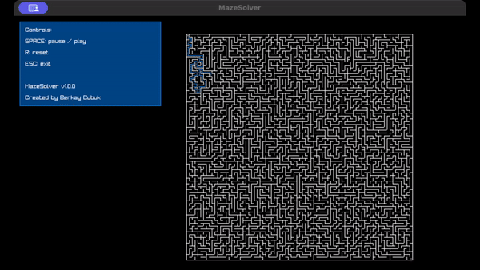

# MazeSolver

I built this project to understand how to solve mazes, and how to generate them as well.

This project uses Raylib and C.

## Development

Make sure you have [raylib](https://www.raylib.com/) installed in your environment.

Run `make run` to build, and run the project.

